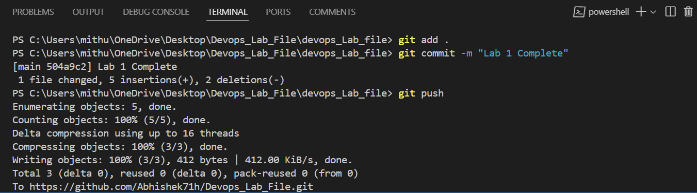
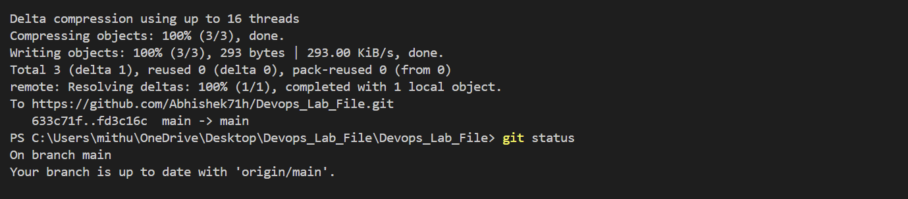

# DevOps-LABFILE

# LAB-1 GIT COMMANDS

git clone https://github.com/SAGAR-SINGH-X-CUBE/DevOps-LABFILE.git


```bash
git add .
git commit -m "figure 1"
git push
```




`git status`



`git diff`


> Checking the block code 


# LAB-2 GIT COMMANDS
*BRANCHING*


Create a file and do 3 commits in it
1st change
```bash
git add .
git commit -m "version1"
```

2nd change
```bash
git add .
git commit -m "version1"
```

3rd change
```bash
git add .
git commit -m "version3"
```